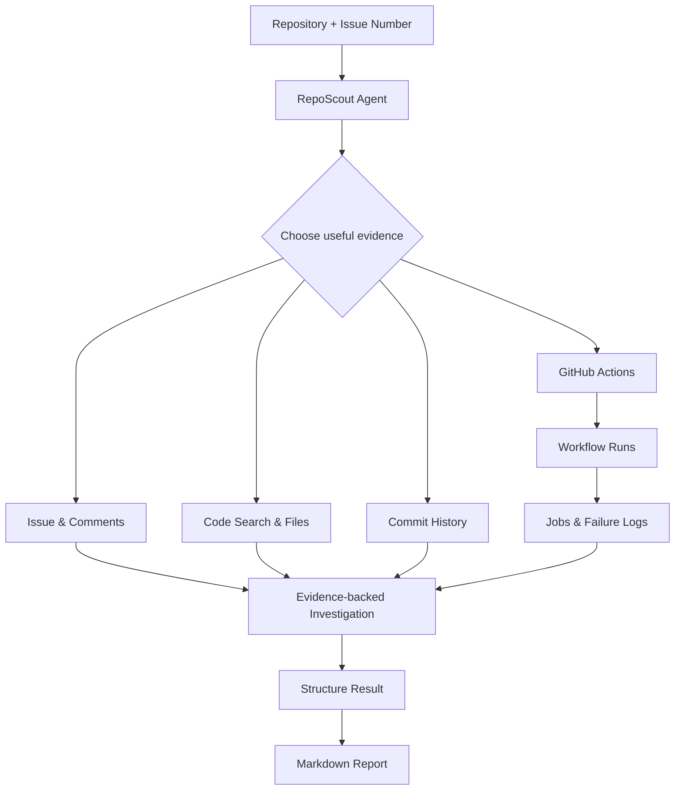

### RepoScout 📜 🧠


RepoScout is a agentic AI project for investigating GitHub issues

Given a repository and an issue number, RepoScout reads the issue and uses a set of read only GitHub tools to investigate it

Depending on the problem it can:

- Search the codebase
- Inspect relevant files and commit history
- Look at GitHub Actions runs and failure logs
- Generate an evidence-backed Markdown report

> [!IMPORTANT]
> Supporting repository for testing this tool - [RepoScout Test Repo](https://github.com/neelkumar01/repoScout-testing)

<hr>

### How it works?



<hr>

### Results 👍

The results were really encouraging. The agent was able to choose different investigation paths, connect evidence from multiple GitHub sources, identify likely root causes and clearly report uncertainty when the available evidence was limited 

Check all the agentic AI generated investigation reports here: [REPORTS](./reports)

<hr>

### Why RepoScout?

Understanding a GitHub issue often involves more than reading its description

A developer may need to:

- Find the relevant code
- Understand how that code behaves
- Check whether something recently changed
- Inspect CI failures
- Read workflow logs
- Separate actual evidence from assumptions

RepoScout explores whether an AI agent can handle this initial investigation using tools while keeping the final result grounded in repository evidence

<hr>

### Available Tools

The agent currently has tools for:

1. Reading an issue
2. Reading issue comments
3. Searching repository code
4. Reading repository files
5. Checking commits that changed a file
6. Inspecting recent GitHub Actions runs
7. Inspecting workflow jobs
8. Extracting useful evidence from job logs

> [!NOTE]
> All repository operations are read only

<hr>

### Problems I Faced 

- Tool call formatting

The model occasionally generated malformed tool arguments or attempted to use tools that were not available. Tool descriptions and the agent instructions were made more explicit to reduce this behavior

- Structured output and tool calling

Using structured output during the same model interaction as tool calling caused compatibility problems with the model provider

The workflow was therefore separated into two stages:

```text
Agent + GitHub tools
        ↓
Technical investigation
        ↓
LLM without tools
        ↓
Structured result
        ↓
Markdown report
```

This keeps tool based investigation separate from final report formatting

- GitHub search errors

LLM generated search queries are not always valid GitHub code search queries. Search failures are handled so that one bad query does not necessarily end the entire investigation

- Agent loops and stopping

I added duplicate tool call protection and a fixed investigation budget. If the budget is reached, RepoScout stops using tools and finishes the analysis using the evidence already collected

- Choosing the right investigation path

Different issues need different evidence. A simple code bug should not trigger CI analysis while a regression may require commit history and a vague issue may require reading comments first. The agent instructions were refined so it chooses tools based on the type of issue instead of following the same path every time

- Confidence and uncertainty

In one vague performance issue the agent initially treated a possible code problem as the confirmed cause without runtime evidence. I added clearer confidence rules so possible causes are separated from proven root causes and missing evidence is explicitly reported

<hr>

### Limitations:

- Analysis depends on the quality of the issue and available repository evidence
- LLM tool calls can occasionally be malformed
- Large CI logs have to be filtered before analysis

> [!TIP]
> The generated report should therefore be treated as an investigation aid rather than a definitive diagnosis
